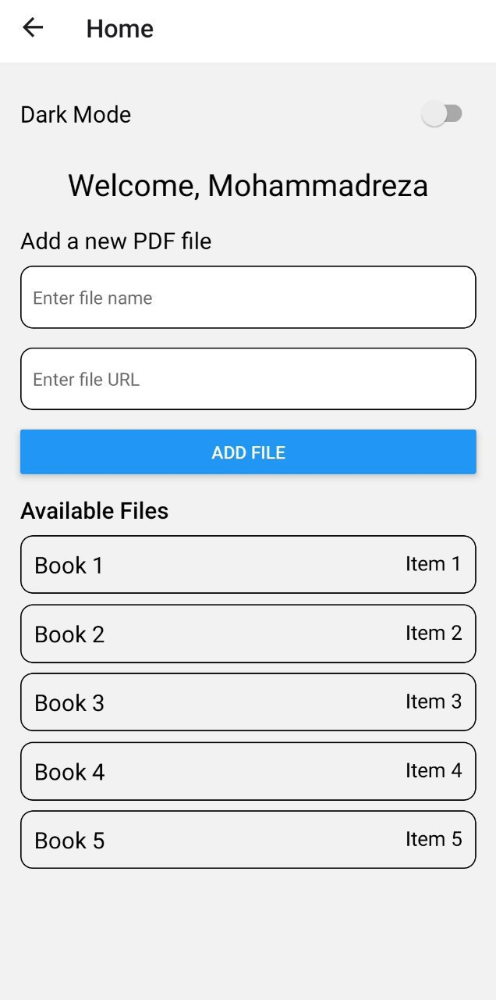
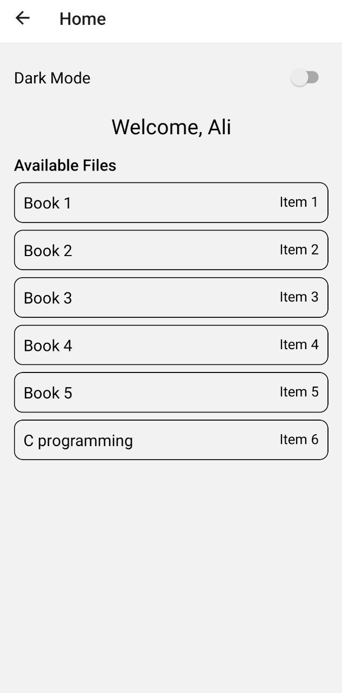
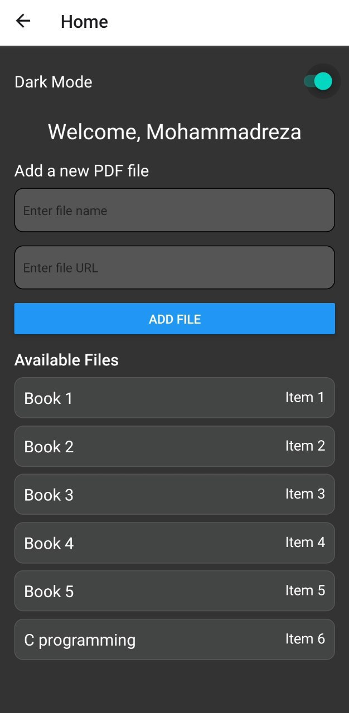

# React Native Expo PDF Viewer App

This React Native Expo project is a PDF viewer application that allows users to sign up, log in, download, and view PDF files stored in a local database. Admin users can also add new PDF files to the database. The app supports light and dark modes for an enhanced user experience.

## Features

- **User Authentication**: Users can sign up with their name, last name, national code, and select a role (user or admin). They can then log in with their national code and role.
- **PDF Management**: Users can view and download PDF files. Admins have the additional capability to add new PDF files by entering the file name and URL.
- **Dark Mode**: Users can toggle between light and dark modes for a better reading experience.
- **Validation**: Input fields are validated to ensure the correctness of the entered data.

## Screenshots

### Signup Screen


### Login Screen


### Home Admin Screen


### Home User Screen


### Dark Mode



## Installation

1. **Clone the repository**:
   ```sh
   git clone https://github.com/yourusername/repo-name.git
   cd repo-name

## Contact
If you have any questions, feel free to contact me at mrsafaran1380@gmail.com .
